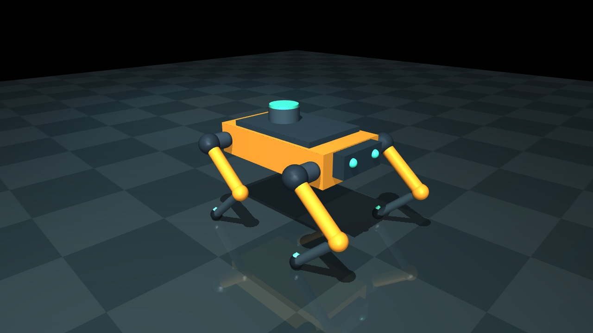

# SENTRY · whole-body robotics lab



A 12-actuator, free-floating quadruped lowers its sensor platform, rejects two physical pushes, and returns to its target pose. Python runs actual MuJoCo dynamics; a browser dashboard replays the rendered experiment with synchronized telemetry and a controller comparison.

```sh
npm install
npm run dev
```

Open **http://127.0.0.1:5173/sentry.html**. Switch between **Whole-body** and **Joint PD**, scrub to either push, and inspect contact loads, body tilt, and height tracking. The checked-in videos and logs are generated by the Python experiment, not a hand-authored animation.

| Nominal 14-second trial | Whole-body | Joint PD |
| --- | ---: | ---: |
| RMS body tilt | 0.182° | 0.959° |
| Peak body tilt | 0.983° | 2.493° |
| Body-height RMSE | 1.50 mm | 14.62 mm |
| Recovery after first / second push | 0.19 / 0.19 s | Not recovered / 0.73 s |

Metrics exclude the first second of settling. Recovery requires 0.5 s continuously below all documented error thresholds, before the next push. These are deterministic simulated results, not statistical reliability estimates.

The five-case sweep includes a failure: the whole-body controller falls with a 4 kg payload, friction 0.25, and 2.5× pushes. It cannot take a recovery step. The joint-PD baseline stays upright but slides about 0.92 m and also fails the mission criteria.

**[Setup, live MuJoCo viewer, controller equations, limitations, and interview walkthrough →](simulation/README.md)**

**[Raw comparison telemetry](public/sentry/experiment.json)** · **[Five-case benchmark](public/sentry/benchmark.json)** · **[Simulation source](simulation)**

This is a stationary whole-body balance and height-control problem. It does not claim walking, perception, reinforcement learning, or hardware deployment.
